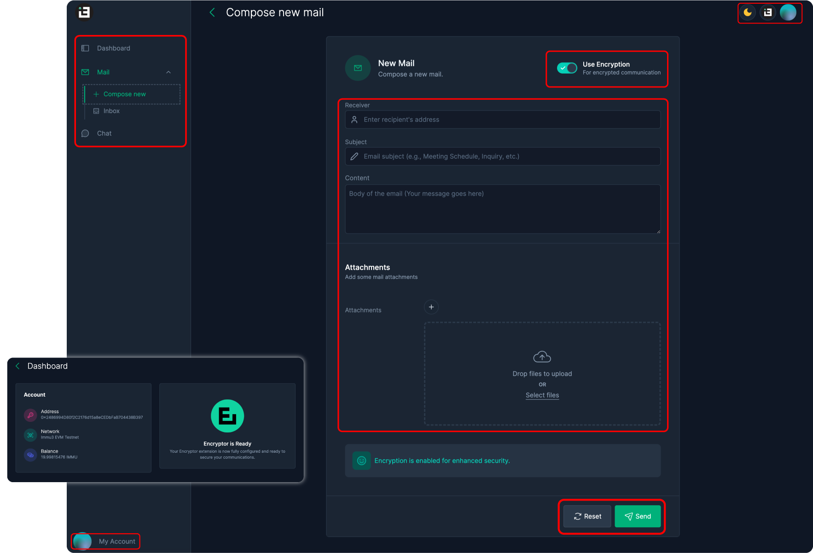
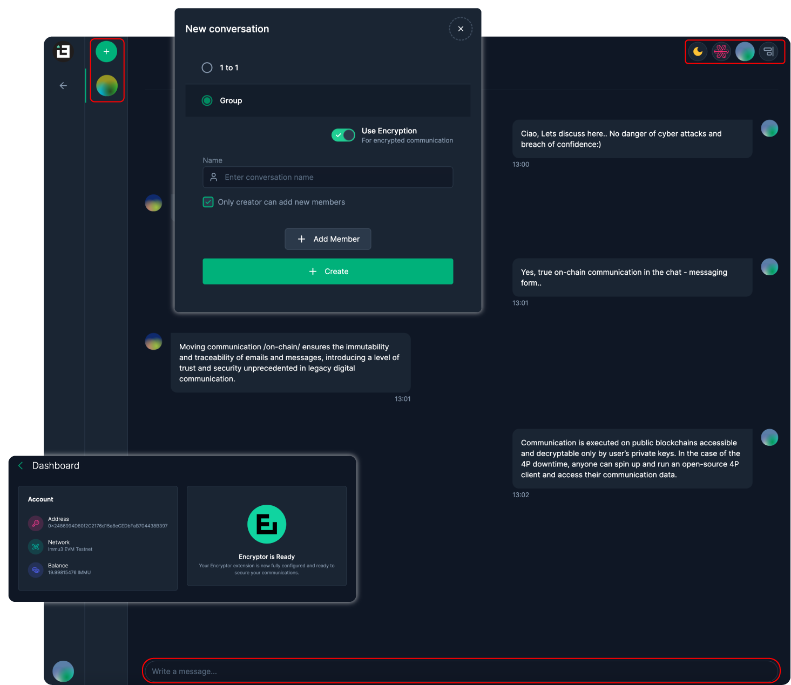

# BlockCommunicator App User Guide

<table data-view="cards"><thead><tr><th></th><th></th><th data-hidden></th></tr></thead><tbody><tr><td>1️⃣ <strong>Wallet Setup</strong></td><td>Install, login, fund your wallet and connect to BlockCommunicator App.</td><td></td></tr><tr><td>2️⃣ <strong>Dashboard Setup</strong></td><td>Setup Encryptor, Mint a Storage NFT, Enable premium features</td><td></td></tr><tr><td>3️⃣ <strong>Sending &#x26; Receiving Blockmails</strong></td><td>Send encrypted on-chain emails or setup the incoming email whitelist.</td><td></td></tr><tr><td>4️⃣ <strong>Messaging &#x26; Group Messaging</strong></td><td>Message or create on-chain encrypted messaging groups.</td><td></td></tr></tbody></table>

### Wallet Setup, App Connection and Blockchain Choice

BlockCommunicator is a Web3-native application supporting [MetaMask](https://support.metamask.io/getting-started/getting-started-with-metamask/), [Coinbase](https://www.coinbase.com/learn/tips-and-tutorials/how-to-set-up-a-crypto-wallet), and Wallet Connect. We recommend beginners take the [MetaMask Web3 101](https://learn.metamask.io/overview) course before starting.

Since BlockCommunicator app services run on-chain, ensure your wallet has enough gas for setup and operations. Currently, we support Fantom Opera, requiring FTM gas tokens.&#x20;

BlockCommunicator app is a multi-chain application. Users can choose between several supported EVM blockchains. We recommend browsing the [supported network list](https://wiki.immu3.io/integrators/multi-chain) and choosing the blockchain most suited to your needs.

Steps:

* ⚙️ Install and login to a supported wallet
* 💰 Fund your wallet with gas
* 🤝 Connect your wallet with the [BlockCommunicator](https://app.blockcommunicator.com) App (app.blockcommunicator.com)
* 🔗 Select blockchain

### Dashboard Setup 

The BlockCommunicator app dashboard is your mission control within the application. It lets you set up self-custodial communication encryption via the Encryptor extension and manage decentralized storage with PX Storage NFTs.

The Encryptor extension adds an encryption layer for blockchain-based mail and messages. A one-time on-chain transaction, requiring gas, saves the sender/recipient's public key.

Decentralized storage and bandwidth are used in communication. PX Storage NFTs, which can be minted as needed, enable self-custodial storage management. Bandwidth usage depends on the number of uploads to decentralized storage.

Steps:

* ⚙️ Download and install the [Encryptor extension](https://chrome.google.com/webstore/detail/encryptor/feolajpinjjfikmmeknkdjbllbppojij?authuser=3\&hl=en-GB) from the Google Chrome Store
* 🔧 Set your Encryptor password and save your seed words
* ⛓️ "**Register Encryptor**" and confirm the transaction with your wallet
* 👌 "**Connect**" your PX Storage NFT and confirm the transaction with your wallet
* ⛏️ "**Mint**" your 100MB Free PX Storage NFT confirm the transaction with your wallet












**Encryptor options;** (1) Unlock your Encryptor = Your Encryptor extension is currently locked. Please unlock it to resume secure communication. (2) Register Your Encryptor = Please complete your registration with the Encryptor extension by creating a transaction on the smart contract. This step is essential to activate the extension’s full capabilities and adds its visibility on the blockchain making the connection between the sender & recipient possible. **PX Storage NFT and Bandwidth upgrade options;** (1) Upgrade existing PX Storage NFT (i.e. every NFT included a specific number of Bandwidth uploads) by choosing between available packages. (2) Mint new PX Storage NFT by choosing between available packages. (3) Buy additional Bandwidth.


### Sending and receiving on-chain mails 

The BlockCommunicator app empowers you to send and receive end-to-end encrypted BlockMails, protecting against data mining, phishing, spoofing, spam, and identity theft. The sender and receiver must be on the same blockchain, as cross-chain emailing is not supported. While encryption is optional, we strongly encourage its use. On-chain communication incurs various [fees](https://wiki.immu3.io/builders/fees-and-integrator-economics) throughout the process.

<figure><figcaption></figcaption></figure>

Sending Blockmails:

* ✉️ Access the "**Compose new**" page available within the Mail menu
* 📄 Fill out the email data form and add the attachments
* 🚀 Click the "**Send**" button and confirm the transaction with your wallet

Receiving Blockmails:

* 📥 Access the "**Inbox**" page available within the Mail menu
* 📨 Review your Blockmails
* ↩️ Reply if needed

Account Whitelisting:

* Access the "**Settings**" page available within the main menu
* Add accounts (wallets) by pasting them in the designated form
* "**Add Account**" and confirm the transaction with your wallet

### **Messaging & Group Messaging**

The BlockCommunicator app lets you send end-to-end encrypted DMs and create on-chain group chats, fully controlled by users and resistant to data mining. Both sender and receiver must be on the same blockchain, as cross-chain messaging is not supported. On-chain messaging incurs various [fees](https://wiki.immu3.io/builders/fees-and-integrator-economics).&#x20;

<figure><figcaption></figcaption></figure>

Steps:

* 💬 Access the "**Chat**" page available within the main menu
* ➕ Add the person to your conversation by clicking plus (+) and pasting his or her wallet address to the designated field
* ✏️ Type the message, confirm it by pressing the Enter key on your keyboard and confirm the transaction with your wallet

Creating Group Chat:

* Click on the plus (+) within the "**Chat**" page
* Select the **"Group"** option
* Add group members by pasting their wallet addresses
* Mark / Unmark **"Only creator can add new members"** according to your specification
* Create a Group and confirm the transaction with your wallet

### Disclaimer

THE SOFTWARE SET FORTH IN THESE TERMS IS PROVIDED 'AS IS”, WITHOUT WARRANTY OF ANY KIND, EXPRESS OR IMPLIED, INCLUDING WITHOUT LIMITATION ANY IMPLIED WARRANTY THAT THE SOFTWARE IS FREE OF DEFECTS, MERCHANTABLE OR FIT FOR A PARTICULAR PURPOSE. NO ORAL OR WRITTEN INFORMATION OR ADVICE GIVEN BY US.

In no event will the Company, its affiliates, distributors or resellers be liable for any indirect, special, incidental or consequential damages arising out of the use of or inability to use the software, including, without limitation, damages for lost profits, loss of goodwill, work stoppage, computer failure or malfunction, or any and all other commercial damages or losses, even if advised of the possibility thereof.
