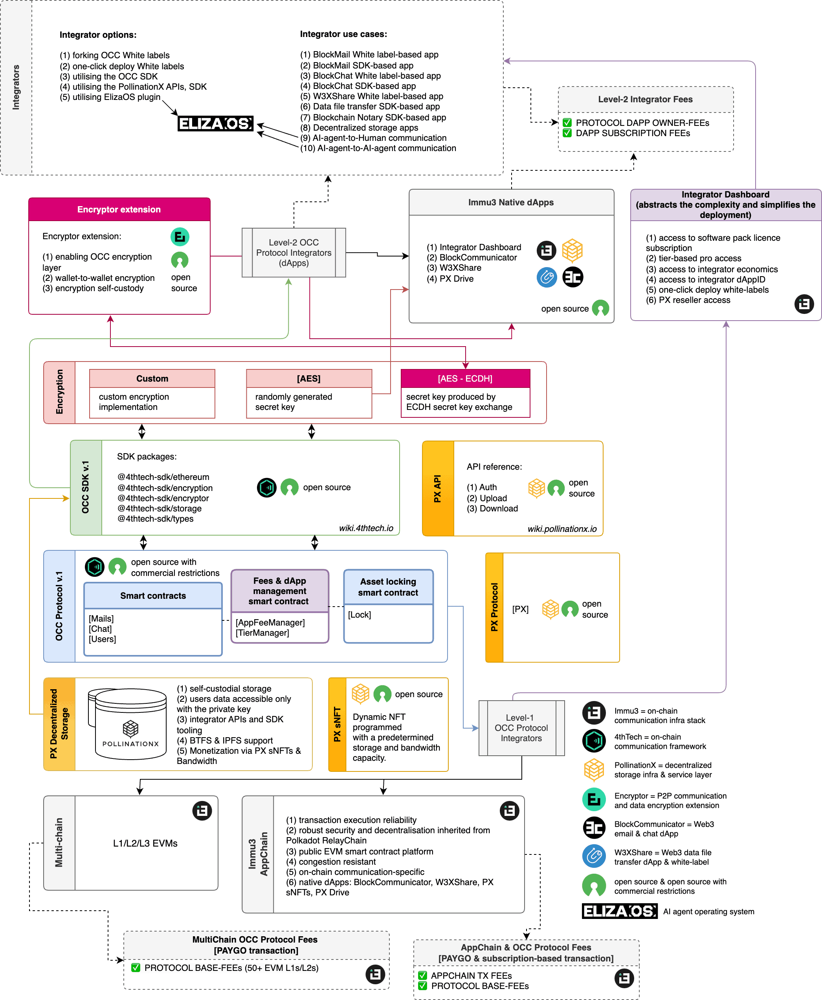

# Architecture by Layers

### Let's Start

Architecture refers to the components and subcomponents or layers that comprise a complete Immu3 stack. Each layer has a unique role, from the underlying blockchain layer, storing data to enabling communication encryption and ensuring user connectivity and integration across the system. Understanding these layers is crucial for developers (i.e., integrators) and start-up entrepreneurs seeking to leverage Immu3s blockchain communication technology effectively.

### Layers

Connected by the [OCC SDK](https://wiki.immu3.io/integrators/occ-sdk) (i.e. software development kit) and later the Integrator Dashboard, seven layers complete the on-chain communication framework:

* Integrator use cases
* [AppSuite](https://wiki.immu3.io/end-users/appsuite)
* [White labels](../occ-white-labels.md)
* [Encryption](encryption.md)
* [OCC Protocol](occ-protocol-v.1.md)
* [Decentralized storage](pollinationx-decentralized-storage-infra.md)
* [Blockchain network](../multi-chain.md)

<figure><figcaption></figcaption></figure>

