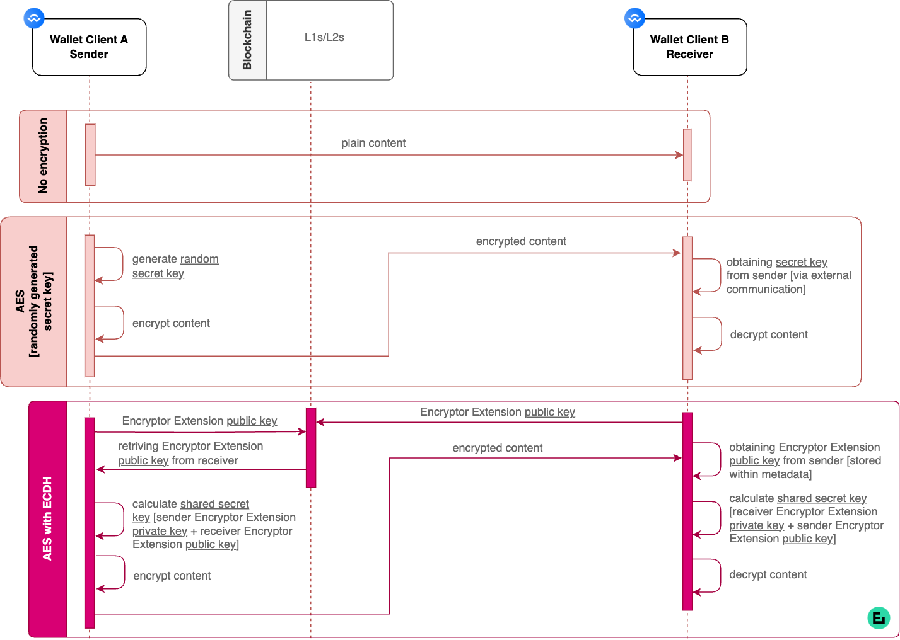

# Encryption

### Let's Start

Encryption is one of the key parts of the infrastructure. There are three options available within the OCC SDK; (1) Custom encryption; (2) AES-randomly generated secret key, and; (3) AES-secret key produced by ECDH. The OCC technology uses GCM (Galois/Counter Mode), which is often considered the safest among all AES modes.

<figure><figcaption></figcaption></figure>

### (1) No encryption

Plain unencrypted content is shared between wallet client A (i.e. sender) and wallet client B (i.e. receiver).

### (2) Custom encryption

Integrators have the option to develop their specific encryption implementations.

### (3) AES (symmetric, secret key encryption)

Natively AES-256-GCM is used for the encryption algorithm. &#x20;

### (3.1) AES (randomly generated secret key)

A random secret key is generated to encrypt content, which is shared between wallet client A (i.e. sender) and wallet client B (i.e. receiver). Content is encrypted with AES encryption. The receiver obtains the secret key from a sender using external communication (i.e. email, chat…) to decrypt the content.


**Explainer:** AES encryption with a randomly generated secret key is used within w3xshare data file transfers.


### (3.2) AES (secret key produced by ECDH secret key exchange enabled by Encryptor extension)

The secret key is produced with ECDH secret key exchange. The sender needs the receiver [Encryptor extension](../clients-and-tools/intro-to-encryptor-extension.md) public key to be recorded on the blockchain. Encryptor extension is used to calculate the shared secret key.&#x20;


**Explainer:** The calculation is made using the receiver Encryptor extension public key and sender Encryptor extension private key. Content is encrypted with AES encryption and shared between wallet client A and wallet client B. The receiver decrypts the content using a calculated shared secret key. The secret key is calculated with the receiver Encryptor extension private key and the sender Encryptor extension public key. AES encryption with a secret key produced by ECDH secret key exchange is used within Email & Chat use cases.


### Resources


