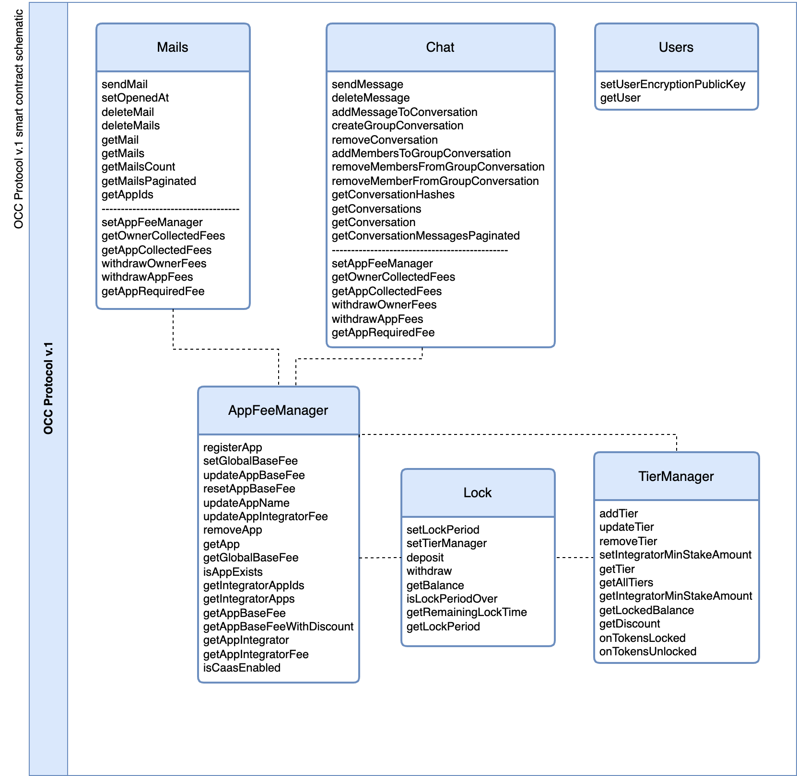

# OCC Protocol v.1

### Overview

The OCC Protocol follows mathematical methods embedded and enforced by smart contracts and can not act in a malicious or harmful manner (e.g. breaking its code primitives by granting access to communication transactions in any way or form). The methods within OCC Protocol smart contracts (i.e. Mail, Chat, Users, AppFeeManager, Lock, TierManager) set simple but strong rules enforcing its core primitives such as; immutability and transparency within P2P decentralized communication.

While built and developed by the 4thTech initiative, the multi-chain OCC Protocol v.1 deployment is the task of a `Level-1` integrator Immu3.&#x20;

<figure><figcaption></figcaption></figure>

### \[Mail] Smart Contract

`[Mail]` smart contract is implementing the following methods;

```
(1) sendMail: self-explanatory 
(2) setOpenedAt: recipient can mark read mail timestamp
(3) deleteMail: self-explanatory
(4) deleteMails: self-explanatory
(5) getMail: self-explanatory
(6) getMails: self-explanatory
(7) getMailsCount: returns the number of received mails 
(8) getMailsPaginated: self-explanatory
(9) getAppIds: self-explanatory
```


**Explainer:** The envelope URL and envelope checksum are saved within the \[Mails] smart contract and include the time of the send information and the sender data (i.e. sender address). Envelope stands for metadata that is stored encrypted on decentralized storage (i.e.PollinationX).


`[Mails]` smart contract enables Web3 data exchange and communication in various use cases. To learn more visit the [use cases](../use-cases-and-integrations.md) page.

### \[Chat] **Smart Contract**

`[Chat]` is a smart contract used for decentralized, encrypted short message exchange over the blockchain. Deployed on various L1s and L2s, the protocol empowers any project to develop Web3 messaging-like communication dApps. Chat smart contract is implementing the following methods;

```
(1) sendMessage: self-explanatory 
(2) deleteMessage: self-explanatory 
(3) addMessageToConversation: self-explanatory 
(4) createGroupConversation: self-explanatory 
(5) deleteGroupConversation: self-explanatory 
(6) addMembersToGroupConversation: self-explanatory 
(7) removeMembersToGroupConversation: self-explanatory 
(8) getConversationHashes: each conversation has its own hash, this method returns an array of user-participation-conversation hashes 
(9) getConversations: self-explanatory 
(10) getConversation: self-explanatory 
(11) getConversationMessagesPaginated: self-explanatory
```


**Explainer:** Messages are stored on-chain, while data and media files are exchanged using PollinationX decentralized storage on demand. &#x20;


The `[Chat]` smart contract enables Web3 data exchange and communication in various use cases. To learn more visit the [use cases](../use-cases-and-integrations.md) page.

### \[Users] **Smart Contract**

`[Users]` smart contract is used to manage user-related on-chain data. It is implementing the following methods;

```
(1) setUserEncryptionPublicKey: self-explanatory
(2) getUser: self-explanatory
```

### \[AppFeeManager] Smart Contract

`[AppFeeManager]` is a smart contract used for the management of app and fee-related tasks. It is implementing the following methods;

```
/(1) registerApp: self-explanatory 
(2) setGlobalBaseFee: self-explanatory 
(3) updateAppBaseFee: self-explanatory 
(4) resetAppBaseFee: self-explanatory 
(5) updateAppName: self-explanatory 
(6) updateAppIntegratorFee: self-explanatory 
(7) removeApp: self-explanatory 
(8) getApp: self-explanatory 
(9) getGlobalBaseFee: self-explanatory 
(10) isAppExists: self-explanatory 
(11) getIntegratorAppIds: self-explanatory 
(12) getIntegratorApps: self-explanatory 
(13) getAppBaseFee: self-explanatory 
(14) getAppIntegrator: self-explanatory 
(15) getAppIntegratorFee: self-explanatory
(16) isCaasEnabled: self-explanatory
```

### \[Lock] Smart Contract

`[Lock]` is a smart contract used for asset-locking-based tasks related to w3CaaS. It is implementing the following methods;

```
(1) setLockPeriod: self-explanatory 
(2) setTierManager: self-explanatory 
(3) deposit: self-explanatory 
(4) withdraw: self-explanatory 
(5) getBalance: self-explanatory 
(6) isLockPeriodOver: self-explanatory 
(7) getRemainingLockTime: self-explanatory 
(8) getLockPeriod: self-explanatory
```

### \[TierManager] Smart Contract

`[TierManager]` smart contract enables end users to set the desired PROTOCOL BASE-FEE DISCOUNT tier, while integrators can access the methods that enable them to withdraw and update dApp OWNER-FEEs.`[TierManager]` smart contract is implementing the following methods;

```
(1) addTier: self-explanatory 
(2) updateTier: self-explanatory 
(3) removeTier: self-explanatory 
(4) setIntegratorMinStakeAmount: self-explanatory 
(5) getTier: self-explanatory 
(6) getAllTiers: self-explanatory 
(7) getIntegratorMinStakeAmount: self-explanatory 
(8) getLockedBalance: self-explanatory 
(9) getDiscount: self-explanatory 
(10) onTokensLocked: self-explanatory 
(11) onTokensUnlocked: self-explanatory
```


**Explainer:** Smart contracts within 4thTech OCC Protocol v.1 are registered under EUPL open-source license with commercial restrictions. GitHub repositories are currently still private, while audits will be available shortly.&#x20;


### Resources



### Audits

We use Slither, the Solidity source analyzer for preliminary smart contracts code audits.&#x20;


**Note:** [Slither](https://github.com/crytic/slither) is a Solidity static analysis framework written in Python3. It runs a suite of vulnerability detectors, prints visual information about contract details, and provides an API to easily write custom analyses. Slither enables developers to find vulnerabilities, enhance their code comprehension, and quickly prototype custom analyses.


What we audit:

* Solidity code vulnerabilities with low false positives ([read more](https://github.com/crytic/slither/blob/master/trophies.md))
