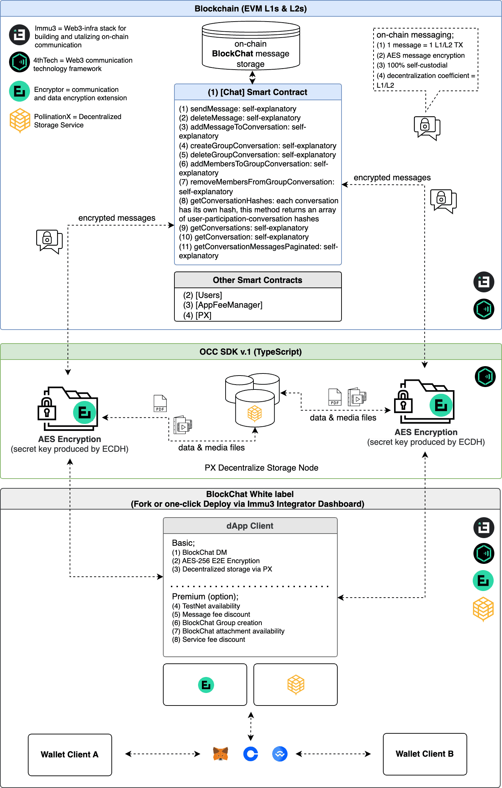

# Intro to BlockChat

### Blockchain Messaging

**Blockchain messaging** (or “BlockChat”) is the process of composing and sending electronic messages using blockchain networks. Each message is recorded as a blockchain transaction, providing a secure and immutable communication method. This approach ensures that messages are delivered peer-to-peer and are resistant to tampering and unauthorized access.

Immu3's block messaging platform is fully on-chain, while data and media files are exchanged via decentralised storage. There is no need for a centralised database. The average message transaction confirmation depends on the transaction finality of the chosen L1 or L2, the same goes for message transaction cost.


**Note:** We refer to blockchain-based Chat as BlockChat. This framework supports on-chain communication, with the level of decentralization matching that of the underlying network. Hence, terms like decentralized Chat, or dChat, are also applicable. However, given potential questions about some blockchain networks' decentralization, we prefer BlockChat. Ultimately, the choice of naming comes down to user preference.


### Features

* Pseudonymous communication via Web3 login
* Multi-chain wallet interoperability via MetaMask, Coinbase or Wallet Connect
* Robust and resistant to Web2 data mining, data ownership loss & phishing
* Self-custodial and immutable
* On-chain verifiable
* E2E encrypted
* [Multi-chain](https://wiki.immu3.io/builders/multi-chain)
* No centralized point of failure
* E2E encrypted DMs and group chat
* Data and media file sharing via decentralized storage
* Contact whitelist availability
* Correspondence fee availability (TBA).

### Technicals

With its unique on-chain “1 message = 1 L1/L2 transaction” model, its decentralization is directly tied to the underlying public blockchain network. Built on the \[Chat] smart contract, OCC SDK, and UI white-label framework, the Block Messaging UI offers a distinctive UX and serves as a sandbox for this new on-chain communication technology.


**Note:** Composed from (1) the message content, and (2) possible data files (i.e. media files, photos…), the individual block message can be from a few kilobytes to gigabytes in size. While encrypted message content gets recorded on the blockchain, the attachments are transmitted via the PX decentralized storage service.


<figure><figcaption></figcaption></figure>

### Fork & Deploy your on-chain Block Messaging App 🚀


[occ-white-labels.md](../occ-white-labels.md)


### Resources


