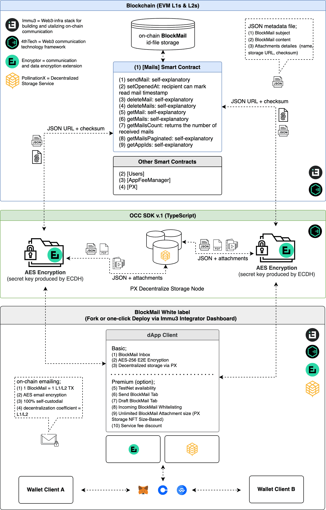

# Intro to BlockMail

### Blockchain Mail

**Blockchain Mail** (or “BlockMail”) is a communication platform that leverages blockchain networks to facilitate peer-to-peer message delivery. In this model, each mail is represented as a blockchain transaction, introducing an unprecedented level of trust and security, and ensuring mail communication immutability and traceability.&#x20;

By recording mail checksum, L1/L2s power the on-chain mailing, while data and media file attachments are exchanged via decentralized storage.&#x20;


**Note:** We refer to blockchain-based Mail as BlockMail. This framework supports on-chain communication, with the level of decentralization matching that of the underlying network. Hence, terms like decentralized Mail, or dMail, are also applicable. However, given potential questions about some blockchain networks' decentralization, we prefer BlockMail. Ultimately, the choice of naming comes down to user preference.


### Features

* Pseudonymous communication via Web3 login
* Multi-chain wallet interoperability via MetaMask, Coinbase or Wallet Connect
* Robust and resistant to Web2 data mining, data ownership loss & phishing
* Self-custodial and immutable
* On-chain verifiable
* E2E encrypted
* [Multi-chain](https://wiki.immu3.io/builders/multi-chain)
* No centralized point of failure
* Attachments sent via decentralized storage
* Contact whitelist availability
* Correspondence fee availability (TBA).

### Technicals

With its unique on-chain “1 BlockMail = 1 L1/L2 transaction” model, its decentralization is directly tied to the underlying public blockchain network. Built on the \[Mail] smart contract, OCC SDK, PX decentralized storage service, and client white-label framework, the OCC-based BlockMail UI offers a distinctive UX and serves as a sandbox for this new on-chain communication technology.


**Note:** Lite-encrypted JSON objects are created to hold BlockMail metadata. The link to this metadata and checksum is recorded on the chain as a blockchain transaction; 1 BlockMail = 1 L1-TX. The on-chain model introduces an unprecedented level of trust and security and ensures the immutability and traceability of message/data communication.


<figure><figcaption></figcaption></figure>

### Fork & Deploy your on-chain BlockMail App 🚀


[occ-white-labels.md](../occ-white-labels.md)


### Resources


