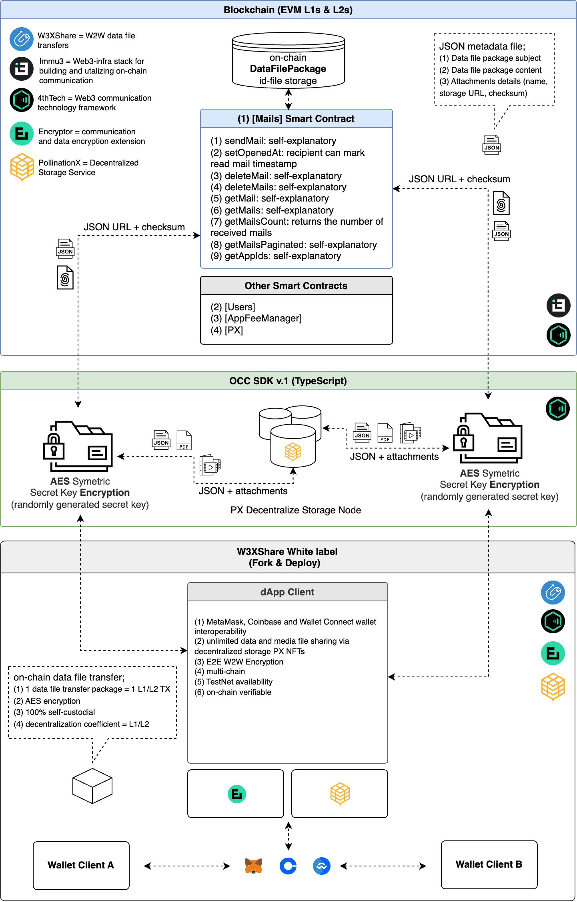

# Intro to Decentralized Data File Sharing

### True Decentralized Data File Sharing

W3XShare is Immu3's integrator answer to P2P data file sharing. It is changing the way how large and sensitive data is transferred in a decentralized manner. It leverages blockchain networks, decentralized storage and communication protocols, to provide a secure and efficient solution for encrypted data transfer between wallets.&#x20;


OCC-based data file sharing is data-heavy, thus processing it completely on-chain is not viable. In contrast, lite encrypted JSON objects are created to hold the data file-sharing package metadata. The link to this metadata and checksum is recorded on the chain as a blockchain transaction; 1 data file exchange package = 1 L1/L2-TX.


### Features

* Pseudonymous communication via Web3 login
* Multi-chain wallet interoperability via MetaMask, Coinbase or Wallet Connect
* Robust and resistant to Web2 data mining, data ownership loss & phishing
* Self-custodial and immutable
* On-chain verifiable
* E2E encrypted
* [Multi-chain](https://wiki.immu3.io/builders/multi-chain)
* No centralized point of failure
* Data and media file sharing via decentralized storage
* PAYGO monetization model

### Technicals

Composed of; (1) subject; (2) content, and; (3) attachment, the data file sharing package can be from a few kilobytes to 100 gigabytes in size. The data file sharing size is limited to the storage size of PX Storage NFT available in the user's wallet. Based on the \[Mails] smart contract, SDKs, PX decentralized storage service and white-label framework, the W3XShare UI showcases the UI/UX for future on-chain data file transfers.

### Technical Stack Schematic

<figure><figcaption></figcaption></figure>

### Fork & Deploy your on-chain data file-sharing App 🚀



### Resources


