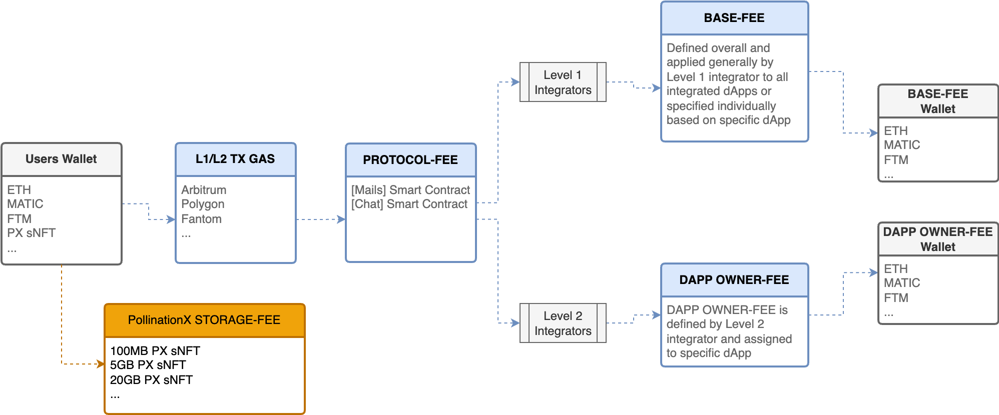

# Fees & Integrator Economics

### Let's Start

Web3 mainly works based on the PAYGO (i.e. pay-as-you-go) transaction model, meaning the user has to pay for every mail, message, or data-sharing transaction. To make on-chain communication more viable, work is being done that will parallel to PAYGO also enable subscription-based models, so the users can pay a monthly subscription fee to access block space and communicate without the hurdle of paying for every transaction.

## Fees within the Protocol

Parallel to the underlying L1/L2 transaction gas cost, the service fees (i.e. protocol fees) are also settled on the smart contract level and are applicable for every mail, message or data file-sharing transaction. Total user cost equals the sum of the L1/L2 transaction gas and service fees and the cost of decentralized storage. Both, the gas and service fees converge and manifest as one end-user communication transaction fee. Fees are handled by the \[[AppFeeManager](architecture-by-layers/occ-protocol-v.1.md#appfeemanager-smart-contract)] smart contract.&#x20;

### Fee Table



<table><thead><tr><th width="219.66666666666663">Smart Contract Methods</th><th>Gas Limit</th><th>*Estimated Price in $S</th><th>*Estimated Price in $FTM</th><th>*Estimated Price in $ROSE</th></tr></thead><tbody><tr><td><code>[Users]</code> Register Encryptor</td><td>145000</td><td>≈ 0.0015S</td><td>≈ 0.0059FTM</td><td>≈ 0.014ROSE</td></tr><tr><td><code>[Mail]</code> Send Mail</td><td>610000</td><td>≈ 0.0061S</td><td>≈ 0.025FTM</td><td>≈ 0.061ROSE</td></tr><tr><td><code>[Mail]</code> Send Data file Package</td><td>610000</td><td>≈ 0.0061S</td><td>≈ 0.025FTM</td><td>≈ 0.061ROSE</td></tr><tr><td><code>[Chat]</code> Send Message</td><td>*500000</td><td>≈ 0.005S</td><td>≈ 0.02FTM</td><td>≈ 0.05ROSE</td></tr><tr><td><code>[Chat]</code> Create Group</td><td>*1025625</td><td>≈ 0.01S</td><td>≈ 0.04FTM</td><td>≈ 0.1ROSE</td></tr><tr><td><code>[PX]</code> Mint free package or new storage</td><td>3800000</td><td>≈ 0.038S</td><td>≈ 0.15FTM</td><td>≈ 0.38ROSE</td></tr><tr><td><code>[PX]</code> Mint Bandwidth</td><td>860000</td><td>≈ 0.009S</td><td>≈ 0.03FTM</td><td>≈ 0.086ROSE</td></tr><tr><td><code>[PX]</code> Upgrade Package</td><td>1240000</td><td>≈ 0.01S</td><td>≈ 0.05FTM</td><td>≈ 0.12ROSE</td></tr></tbody></table>



| dApp              | Smart Contract | Base Fee                    | dApp Fee                    | Total                        | Bandwidth                |
| ----------------- | -------------- | --------------------------- | --------------------------- | ---------------------------- | ------------------------ |
| BlockCommunicator | `[Mail]`       | TBD                         | TBD                         | /                            | /                        |
| BlockCommunicator | `[Chat]`       | TBD                         | TBD                         | /                            | /                        |
| W3XShare App      | `[Mail]`       | \~0.0075$ S, FTM, ROSE... ≡ | \~0.0925$ S, FTM, ROSE... ≡ | \~**0.1$** S, FTM, ROSE... ≡ | 2                        |
| 4P Super App      | `[Mail]`       | \~0.0075$ S, FTM, ROSE ≡    | \~0.0025$ S, FTM, ROSE ≡    | \~**0.01$** S, FTM, ROSE ≡   | 1 (json) + X attachments |
| 4P Super App      | `[Chat]`       | \~0.0025$ S, FTM, ROSE ≡    | \~0.0025$ S, FTM, ROSE ≡    | \~**0.005$** S, FTM, ROSE ≡  | /                        |



| Size    | Bandwidth Limit | Estimated Price in $S | Estimated Price in $FTM | Estimated Price in $ROSE |
| ------- | --------------- | --------------------- | ----------------------- | ------------------------ |
| `100MB` | 25 uploads      | Free                  | Free                    | Free                     |
| `1GB`   | 50 uploads      | ≈ 12S                 | ≈ 12FTM                 | ≈ 80ROSE                 |
| `5GB`   | 150 uploads     | ≈ 35S                 | ≈ 35FTM                 | ≈ 240ROSE                |
| `20BG`  | 400 uploads     | ≈ 70S                 | ≈ 70FTM                 | ≈ 470ROSE                |



| Bandwidth  | Estimated Price in $S | Estimated Price in $FTM | Estimated Price in $ROSE |
| ---------- | --------------------- | ----------------------- | ------------------------ |
| 10 uploads | ≈ 3S                  | ≈ 3FTM                  | ≈ 16ROSE                 |



<table><thead><tr><th width="163.66666666666663">Function</th><th width="196">GAS Tracker</th><th width="207">Unit Converter</th><th>Token</th></tr></thead><tbody><tr><td>Fantom</td><td><a href="https://ftmscan.com/gastracker">Fantom GasTracker</a></td><td><a href="https://ftmscan.com/unitconverter">Fantom UnitConverter</a></td><td>FTM</td></tr><tr><td>Oasis Sapphire</td><td>/</td><td>/</td><td>ROSE</td></tr></tbody></table>




**\*Note:** Crypto prices are estimated and calculated based on; (1) Sonic 10 GWei; (2) Fantom 41 GWei, and; (3) Oasis 100 GWei gas price. The "Send message" gas limit is based on the length of the message. The "Create Group" gas limit depends on the number of members in the group and the encryption variable. Table calculation is based on a two-member encrypted group. References to USD prices are made for approximate fiat value illustration purposes only.


### User cost calculation estimate per message transaction

Let's assume that:&#x20;

> Blockchain fees = \~0.009$ FTM ≡
>
> Service base-fee = \~0.0025$ FTM ≡
>
> Service dApp-owner-fee  = \~0.0025$ FTM... ≡
>
> **Total user cost = \~0.014$ FTM... ≡**

## Integrator Economics

OCC Protocol v.1 build-in monetization layers enable independent integrator economics, permitting developers to focus on application UI/UX features. `Level-1` integrators can set the desired protocol base fees, while `Level-2` integrators can set and manage their protocol dApp-owner fees.

### Monetization Schematic

<figure><figcaption></figcaption></figure>
