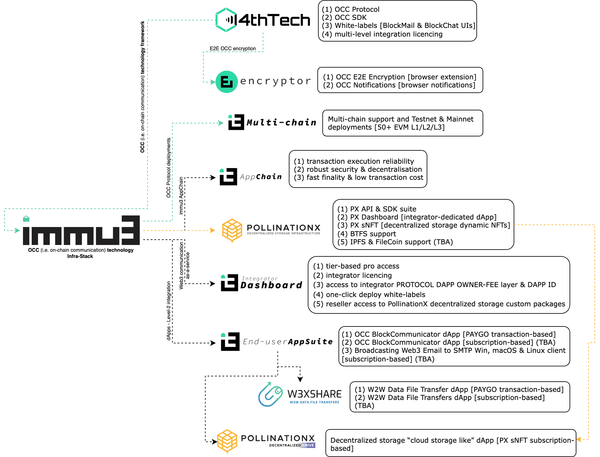

# Ecosystem Overview

Here are some clarifications of various areas within the "Immu3" ecosystem:

* **CR Systems \[Immu3]:** Acts as `Level-1` integrator of Block Labs \[4thTech] on-chain communication technology, focusing on the abstraction, adoption and commercialization while offering `Level-2` permissionless licences to on-chain communication dApp developers.
* **CR Systems \[PollinationX]:** Suite of back-end services that enable developers to connect to custom decentralized storage nodes via dedicated service API & SDK, while utilizing the read-and-write methods of supported decentralized storage out-of-the-box.
* **Block Labs \[4thTech]:** The company and the initiative which developed the genesis OCC Protocol, along with the OCC SDK and BlockMail & BlockChat white-label framework.&#x20;
* **OCC Protocol v.1 \[4thTech]:** A suite of EVM smart contracts developed by the 4thTech initiative, that together create an on-chain communication framework and facilitate data ownership retention within the peer-to-peer mailing, messaging, data-sharing, or any other form of on-chain communication.
* **Encryptor extension \[4thTech]:** The Google Chrome extension, developed by the 4thTech initiative adds the communication encryption layer currently not supported in major wallets.
* **AppChain \[Immu3]:** A public EVM smart contract platform that offers reliability, scalability and security needed within use cases of on-chain communication.
* **Integrator Dashboard \[Immu3]:** Unlocks the skill and know-how required to abstract the complexities and simplify the deployment of on-chain communication apps while reducing deployment time from the duration of months to under an hour, while enabling the model of the w3CaaS (i.e. web3 communication as a service).
* **End-user app suite \[Immu3]:** Offers a self-custodial Web3 alternative to legacy email, messaging and data-sharing communication platforms.

<figure><figcaption></figcaption></figure>
