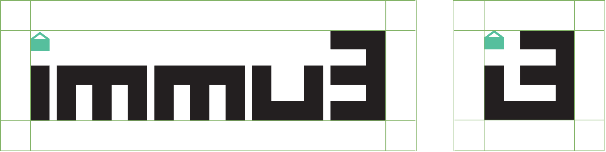

# Branding

Follow these guidelines when promoting Immu3 in marketing communications, including advertising, articles, websites, and printed promotions.

Immu3’s logotype is constructed and designed from custom-built, modular forms. It draws its inspiration from code brackets, rotating and combining them into the unique logomark shape.

### Clearspace

Space surrounding the logo or logomark is needed to prevent distortions and creative misunderstanding. Please see the minimum spacing specifications below.&#x20;

<figure><figcaption></figcaption></figure>

### Colours

| Immu3 Green | Immu3 Black | Immu3 Gradient    |
| ----------- | ----------- | ----------------- |
| #56bf9d     | #231f20     | #56bf9d / #231f20 |

### Asset Downloads

<table><thead><tr><th>Main Logotype</th><th width="222.33333333333331">Logomark</th><th>Gradient</th></tr></thead><tbody><tr><td><a href="https://github.com/immu3-io/static-assets/blob/aaf03e325e7cb0e289e46e0155a88e20b63d2d49/image/immu3-logo-black.png">immu3-logo-black.png</a></td><td><a href="https://github.com/immu3-io/static-assets/blob/aaf03e325e7cb0e289e46e0155a88e20b63d2d49/image/immu3-icon-black.png">immu3-icon-black.png</a></td><td><a href="https://github.com/immu3-io/static-assets/blob/98ba3560a0ee8d4d051176d96225eb691adb5f59/image/immu3-gradient.png">immu3-gradient.png</a></td></tr><tr><td><a href="https://github.com/immu3-io/static-assets/blob/aaf03e325e7cb0e289e46e0155a88e20b63d2d49/image/immu3-logo-black.svg">immu3-logo-black.svg</a></td><td><a href="https://github.com/immu3-io/static-assets/blob/aaf03e325e7cb0e289e46e0155a88e20b63d2d49/image/immu3-icon-black.svg">immu3-icon-black.svg</a></td><td><a href="https://github.com/immu3-io/static-assets/blob/98ba3560a0ee8d4d051176d96225eb691adb5f59/image/immu3-gradient.svg">immu3-gradient.svg</a></td></tr><tr><td><a href="https://github.com/immu3-io/static-assets/blob/aaf03e325e7cb0e289e46e0155a88e20b63d2d49/image/immu3-logo-white.png">immu3-logo-white.png</a></td><td><a href="https://github.com/immu3-io/static-assets/blob/aaf03e325e7cb0e289e46e0155a88e20b63d2d49/image/immu3-icon-white.png">immu3-icon-white.png</a></td><td><a href="https://github.com/immu3-io/static-assets/blob/98ba3560a0ee8d4d051176d96225eb691adb5f59/image/immu3-gradient-and-logo.png">immu3-gradient-and-logo.png</a></td></tr><tr><td><a href="https://github.com/immu3-io/static-assets/blob/aaf03e325e7cb0e289e46e0155a88e20b63d2d49/image/immu3-logo-white.svg">immu3-logo-white.svg</a></td><td><a href="https://github.com/immu3-io/static-assets/blob/aaf03e325e7cb0e289e46e0155a88e20b63d2d49/image/immu3-logo-white.svg">immu3-icon-white.svg</a></td><td><a href="https://github.com/immu3-io/static-assets/blob/98ba3560a0ee8d4d051176d96225eb691adb5f59/image/immu3-gradient-and-logo.svg">immu3-gradient-and-logo.svg</a></td></tr></tbody></table>
